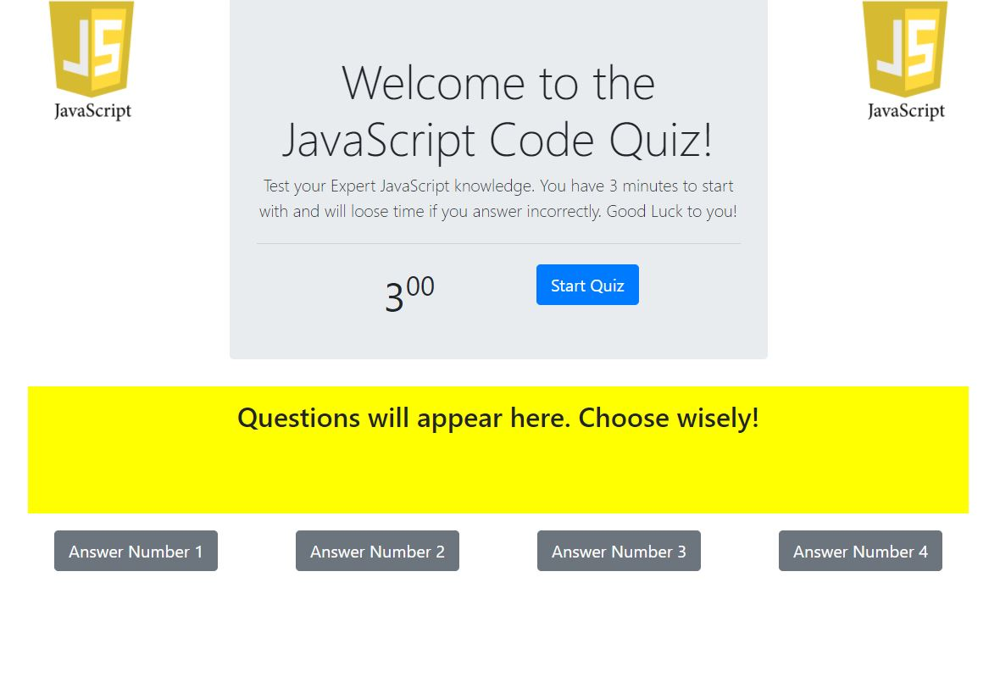
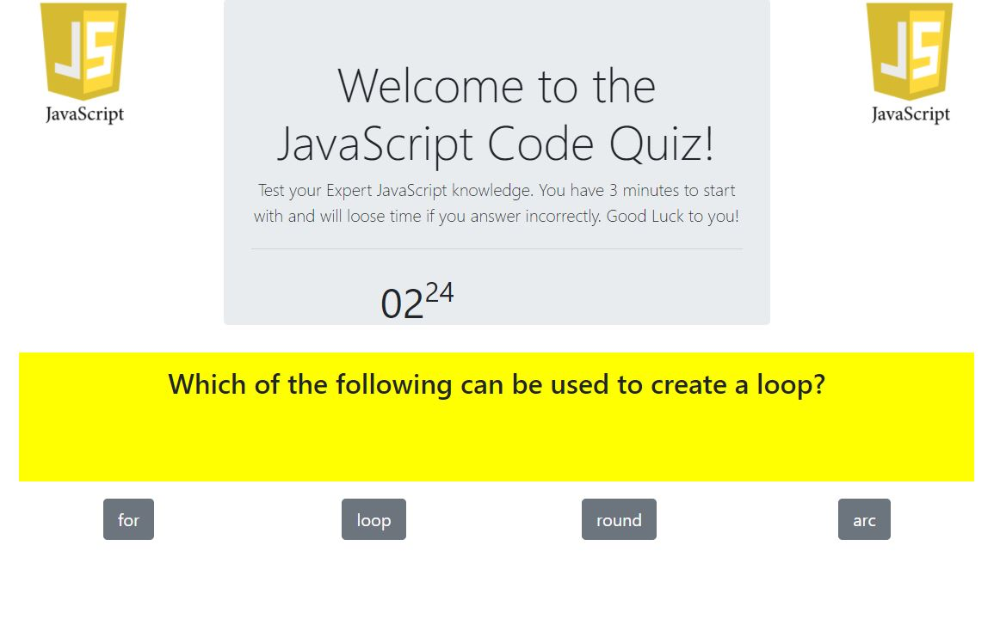
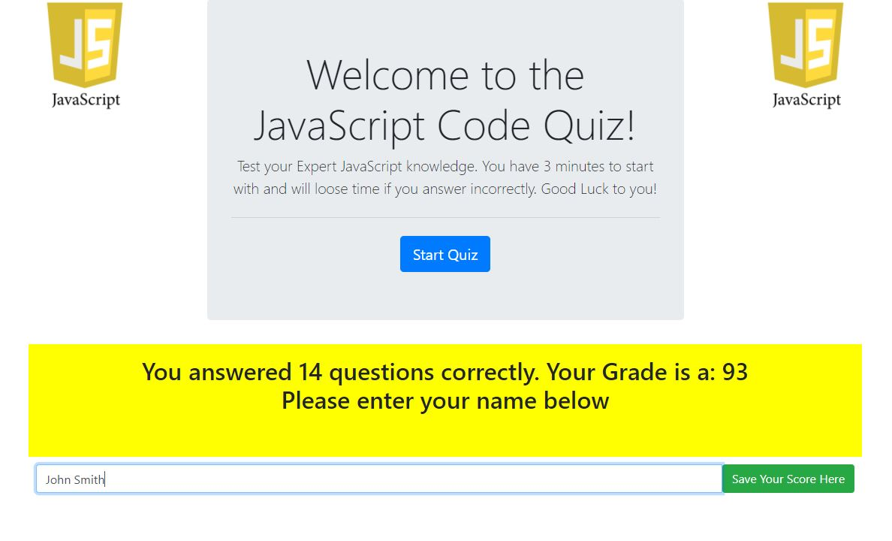

# JS Code Quiz

JavaScript is a programming language that is used in conjunction with HTML and CSS to implement features into your web pages that are far more complex. It runs in the backgrond, where the user cannot see, however when the user interacts with the webpage, it is more than likely JavaSript that makes the interactions possible.

## JavaScript Knowledge

How well do you know JavaScript? Well lets find out. This JS Code Quiz is designed to test your overall knowledge of this programming language. Whether you are a novice or a seasoned coder, you may still learn something during this quiz.

## Instructions

- This is a timed quiz. You will be given 3 minutes to answer 15 questions. The timer will count down in the middle of the page.
- You will be presented with a series of questions, some easy and some hard, all having to do with JavaScript in some way, shape or form.
- If you answer the question CORRECTLY, you will simply move on to the next question.
- If you answer the question INCORRECTLY, then you will loose 10 seconds from the timer and then move on to the next question.
- Although it is a timed quiz, make sure you take the time to answer correctly, for you only get one chance to answer.
- When you are done with the quiz, or run out of time, you will be told how many questions you got right and you will be given your overall "grade".
- Let your knowledge show and good luck!

## Screenshots

